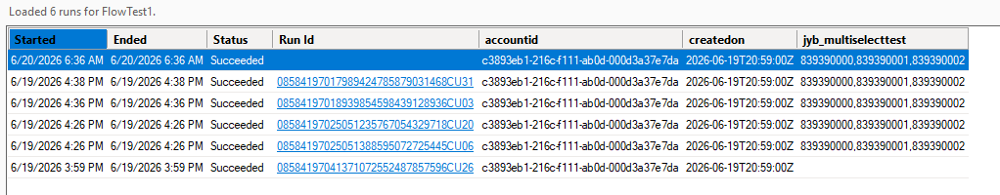
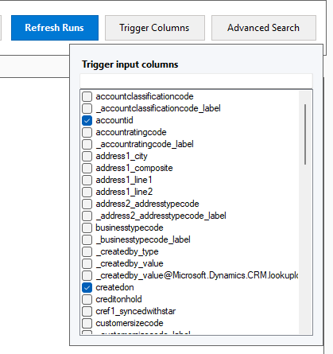

<p align="center">
  
</p>

# Flow Run Finder

Flow Run Finder is an XrmToolBox plugin for finding Power Automate flow runs and inspecting the related trigger data.

It is useful when you know a flow ran, but need to answer questions like:

- Which run handled the update of this record?
- What happened during a specific time window?

This plugin hosts the shared `FlowRunFinderV2.Core` logic from [Flow Run Finder V2](https://github.com/johnyenter-briars/FlowRunFinderV2).

## Features

| Status | Feature | Details |
| --- | --- | --- |
| ✅ | XrmToolBox connection | Use the active XrmToolBox connection to identify the Dataverse environment. |
| ✅ | Interactive and device-code sign-in | Use browser-based authentication or switch to device-code authentication in Settings. |
| ✅ | Flow picker | Search and select cloud flows from the connected environment. |
| ✅ | Run history | Load recent runs from the Power Automate API or the Dataverse `flowrun` history table. |
| ✅ | Dynamic trigger columns | Discover trigger-input fields from loaded runs, choose visible columns, and remember selections per flow. |
| ✅ | Advanced search | Search a local date/time window converted to UTC using grouped `AND` / `OR` filters with `Equals` and `Contains` comparisons. |
| ✅ | Search progress and cancellation | See candidate, scanned, and match counts while an advanced search runs, and cancel it when needed. |
| ✅ | Run links and copy actions | Open runs in make.powerautomate.com or right-click to copy run links and grid values. |
| ✅ | Local logging | Write daily logs locally with configurable verbosity, including match criteria at debug level. |
| ⏳ | Filter by flow status | Filter results by run status, such as `Succeeded`, `Failed`, or `Canceled`. |
| ⏳ | Export results | Export the current run list and selected trigger columns to CSV or another file format. |
| ⏳ | Action-level run inspection | Inspect individual actions and their inputs/outputs inside a run. |
| ⏳ | Saved search presets | Save and reuse advanced-search time windows and filter groups. |
| ⏳ | Multiple flow queries | Query identical trigger conditions, but across multiple flows |

## Screenshots






## Setting Up A Connection

Connect XrmToolBox to your Dataverse / Dynamics 365 environment as normal, then open **Flow Run Finder** from the plugin list.

The plugin uses the active XrmToolBox connection only to identify the environment URL. It does **not** use the native XrmToolBox connection token for Core operations.

Authentication for Dataverse and Power Automate is handled by `FlowRunFinderV2.Core` through Microsoft interactive browser or device-code authentication and local MSAL token caching.

## Using The Tool

After opening the plugin, click **Reload Flows** to authenticate and load cloud flows from the connected environment.

Select a cloud flow from the flow picker. The plugin loads the latest runs and shows the run start time, end time, status, and run id.

Use **Trigger Columns** to choose which trigger input fields should appear in the grid. The list is based on trigger payloads returned for loaded runs, so it can include custom Dataverse columns and dynamic trigger values.

Use **Advanced Search** when recent runs are not enough. Set a local start and end date/time, then add filters against trigger input values. Filters can be grouped with `AND` and `OR`, which is useful for searches like:

```text
accountid equals {GUID}
AND
statuscode equals 1
```

or:

```text
name contains test
OR
websiteurl contains contoso
```

The selected date/time values are converted to UTC for the run query. Advanced search scans run history newest-to-oldest and avoids loading trigger payloads until a run is inside the requested time window.

While an advanced search is running, the plugin reports its candidate count, scan progress, and current match count. Use **Cancel** in the busy indicator to stop a long-running query.

Click a run id to open the run in Power Automate. Right-click a run id to copy the run URL, or right-click another grid cell to copy that value.

## Settings

The settings screen supports:

- Default run count
- Max runs to query
- Flow run history table toggle
- Authentication flow
- Dataverse client ID
- Power Automate client ID
- Log verbosity

The flow run history table toggle controls whether run queries use the Dataverse `flowrun` table or the Power Platform API.

## Local Files

The plugin keeps its local data here:

```text
%LOCALAPPDATA%\FlowRunFinder
```

Notable files and folders:

- `settings.json`: plugin settings and selected trigger columns
- `connections`: per-environment token caches
- `logs`: daily log files

Token cache files are stored per environment connection under:

```text
%LOCALAPPDATA%\FlowRunFinder\connections\<connection-guid>\
```

Device-code cache files are stored under:

```text
%LOCALAPPDATA%\FlowRunFinder\connections\<connection-guid>\auth\devicecode\
```

Interactive browser cache files are stored under:

```text
%LOCALAPPDATA%\FlowRunFinder\connections\<connection-guid>\auth\interactivebrowser\
```

To force re-authentication, delete the relevant auth cache folder under `%LOCALAPPDATA%\FlowRunFinder\connections`.

## Installation

1. Open **XrmToolBox**.
2. Click **Plugin Store** in the toolbar.
3. Search for **Flow Run Finder**.
4. Click **Install**.
5. Restart XrmToolBox.

## Requirements

- [XrmToolBox](https://www.xrmtoolbox.com) v1.2025.10.74 or later
- A Power Automate / Power Platform environment
- Internet access for Dataverse, the Power Automate REST API, and first-time interactive browser or device-code authentication

## Development

This project depends on `FlowRunFinderV2.Core` from the [Flow Run Finder V2 repo](https://github.com/johnyenter-briars/FlowRunFinderV2).

For local builds, download the Flow Run Finder V2 repo at the relative path referenced by the project file, then build the Core project first. The Core DLL must exist under:

```text
..\..\..\FlowRunFinderV2\src\FlowRunFinderV2\FlowRunFinderV2.Core\bin\Debug\netstandard2.0\FlowRunFinderV2.Core.dll
```

Build this solution with:

```powershell
dotnet build .\src\FlowRunFinder.sln
```

That direct DLL reference is intentional for now. If the V2 Core project changes, rebuild `FlowRunFinderV2.Core` first so this XrmToolBox plugin picks up the updated API surface.

Release packaging uses ILRepack to merge `FlowRunFinderV2.Core.dll` into `FlowRunFinder.dll`.

| Component | Description |
| --- | --- |
| `FlowRunFinder` | XrmToolBox `net48` plugin UI and host integration. |
| `FlowRunFinderV2.Core` | Shared .NET Standard 2.0 application logic for auth, clients, settings, logging, models, and query behavior. |

## AI Disclosure

- AI-assisted tooling was used in the development of this codebase.

## License

- License: [MIT](LICENSE)
